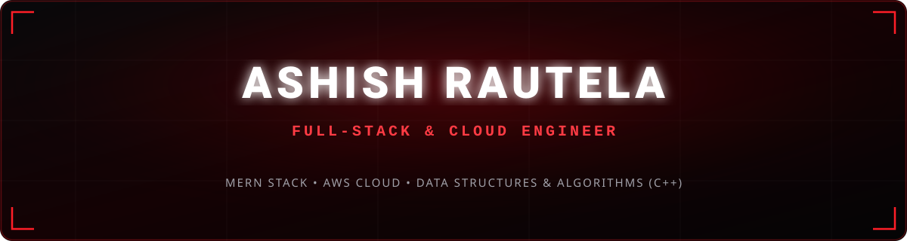
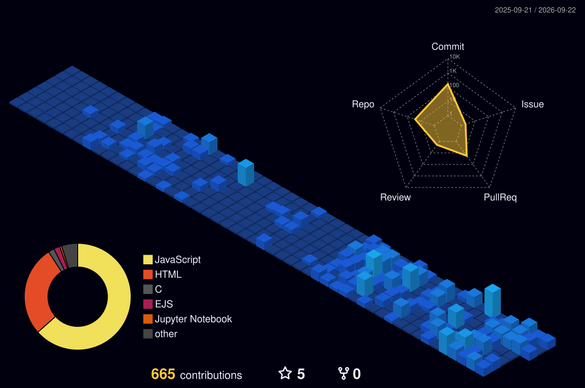

<div align="center">

  <!-- Local Custom Obsidian & Crimson Vector Banner -->
  

  <br/>

  <!-- Animated Glowing Red Typing Subtitle -->
  <a href="https://github.com/Ashish-Rautela">
    
  </a>

  <br/>

  <!-- Status & Highlight Badges -->
  <p align="center">
    
    
    
    
  </p>

  <!-- Connect Links in Red & Black -->
  <p align="center">
    <a href="https://www.linkedin.com/in/ashish-rautela-82322b33a/" target="_blank">
      
    </a>
    <a href="https://leetcode.com/u/ashish0leet/" target="_blank">
      
    </a>
    <a href="mailto:ashishrautela190@gmail.com">
      
    </a>
    <a href="https://github.com/Ashish-Rautela">
      
    </a>
  </p>

</div>

---

### ⚔️ Terminal Profile

```zsh
ashish@workstation:~$ neofetch --profile
-------------------------------------------------------------------------
> Name          : Ashish Rautela
> Focus         : Full-Stack Engineering, Cloud Systems & Low-Latency APIs
> Education     : B.E. in Computer Science @ Graphic Era Hill University (SGPA: 8.53)
> Core Stack    : Node.js • Express.js • React • Next.js • MongoDB • DynamoDB • Redis
> Cloud & Ops   : AWS (Lambda, EventBridge, SQS, API GW, Step Functions, CloudWatch) • Docker
> Problem Solver: 500+ LeetCode DSA Solutions in C++ (Graphs, DP, Trees, Greedy)
> Achievements  : Runner-up @ IIT Guwahati Hackathon • WCHL National Qualifier
-------------------------------------------------------------------------
```

---

### 🏆 Honors & Key Engineering Highlights

<table width="100%">
  <tr>
    <td width="50%" valign="top">
      <h4>⚡ Core Engineering Highlights</h4>
      <ul>
        <li>🚀 <b>AI Automation:</b> Built template generator powered by <b>Gemini 2.5 Flash</b>, cutting generation turnaround by <b>90%</b>.</li>
        <li>☁️ <b>Event Pipelines:</b> Engineered bulk campaign scheduler on <b>AWS EventBridge &amp; Lambda</b>.</li>
        <li>💾 <b>Database Optimization:</b> Reworked <b>DynamoDB</b> schemas to eliminate duplicate data paths.</li>
        <li>🛡️ <b>Infrastructure as Code:</b> Provisioned AWS serverless stacks (CloudFormation, SQS, Step Functions, CloudWatch).</li>
      </ul>
    </td>
    <td width="50%" valign="top">
      <h4>🎖️ Honors &amp; Milestones</h4>
      <ul>
        <li>🏆 <b>Runner-up</b> — <i>IIT Guwahati Hackathon</i></li>
        <li>🏅 <b>National Round Qualifier</b> — <i>World Cup Hackathon League (WCHL)</i></li>
        <li>🧠 <b>500+ DSA Problems Solved</b> on <i>LeetCode</i> across Graphs, Dynamic Programming, Trees, and Advanced Structures.</li>
        <li>🌐 <b>Open-Source Contributor</b> to <i>Sugar Labs (Music Blocks)</i> with production PRs merged.</li>
      </ul>
    </td>
  </tr>
</table>

---

### 🌐 3D Contribution Matrix & Contribution Grid

<div align="center">
  <!-- 3D Night View Contribution Matrix -->
  <a href="https://github.com/Ashish-Rautela">
    
  </a>

  <br/><br/>

  <!-- Crimson Contribution Snake Animation -->
  <picture>
    <source media="(prefers-color-scheme: dark)" srcset="https://raw.githubusercontent.com/Ashish-Rautela/Ashish-Rautela/output/github-contribution-grid-snake-dark.svg">
    <source media="(prefers-color-scheme: light)" srcset="https://raw.githubusercontent.com/Ashish-Rautela/Ashish-Rautela/output/github-contribution-grid-snake.svg">
    
  </picture>
</div>

---

### 🛠️ Weapons of Choice (Tech Stack)

<div align="center">
  <p>
    <a href="https://skillicons.dev">
      
    </a>
  </p>
</div>

<table width="100%">
  <tr>
    <td width="33%" valign="top">
      <b>💻 Languages</b><br/>
      <code>C++</code> <code>C</code> <code>Python</code> <code>Java</code> <code>JavaScript</code> <code>TypeScript</code> <code>Solidity</code>
    </td>
    <td width="33%" valign="top">
      <b>⚙️ Backend &amp; Systems</b><br/>
      <code>Node.js</code> <code>Express.js</code> <code>MongoDB</code> <code>DynamoDB</code> <code>Redis</code> <code>REST APIs</code> <code>Microservices</code>
    </td>
    <td width="33%" valign="top">
      <b>☁️ Cloud &amp; DevOps</b><br/>
      <code>AWS Lambda</code> <code>API Gateway</code> <code>EventBridge</code> <code>SQS</code> <code>Step Functions</code> <code>Docker</code> <code>CI/CD</code>
    </td>
  </tr>
</table>

---

### 🚀 Featured Repositories & Engineering Builds

| Project | Highlights & Architecture | Tech Stack | Link |
| :--- | :--- | :--- | :---: |
| 📝 **SynkDocs** | Serverless document platform with 12 REST API endpoints on AWS Lambda & DynamoDB (~180ms latency). Integrated Amazon SQS for background processing and automated GitHub Actions CI/CD. | `React.js` `Node.js` `AWS Lambda` `DynamoDB` `SQS` `Amplify` | [Repo](https://github.com/Ashish-Rautela/SynkDocs-backend) |
| 🎟️ **EventFlow** | High-throughput event-driven backend processing 800–1,000 events/min. Uses Redis atomic offsets, dead-letter queue (DLQ) retry pipelines, and lag monitoring across 3 parallel consumers. | `Node.js` `MongoDB` `Redis` `Event-Driven` | [Repo](https://github.com/Ashish-Rautela/EventFlow) |
| 🗳️ **Decentralized Voting** | Blockchain voting architecture with smart contracts for tamper-resistant vote recording. Features role-based access control, on-chain validation, and 12–15 tx/s throughput on Hardhat. | `Solidity` `Smart Contracts` `Node.js` `React.js` `Hardhat` | [Repo](https://github.com/Ashish-Rautela/Decentralized_Online_Voting_System) |
| 🤖 **AI Template Engine** | WhatsApp template generator powered by Gemini 2.5 Flash integrated with Meta WhatsApp API and AWS EventBridge bulk scheduler. | `Gemini AI` `AWS EventBridge` `Node.js` `Lambda` | [View Profile](https://github.com/Ashish-Rautela) |

---

### 📈 Live Activity Wave

<div align="center">
  
</div>

---

### ⚡ Philosophy

<div align="center">
  <blockquote>
    “Code is like humor. When you have to explain it, it’s bad.” – Cory House 😄
  </blockquote>
  <p>🔥 Passionate about building robust distributed systems, low-latency APIs, and solving hard algorithmic problems.</p>
</div>

<div align="center">
  
</div>
